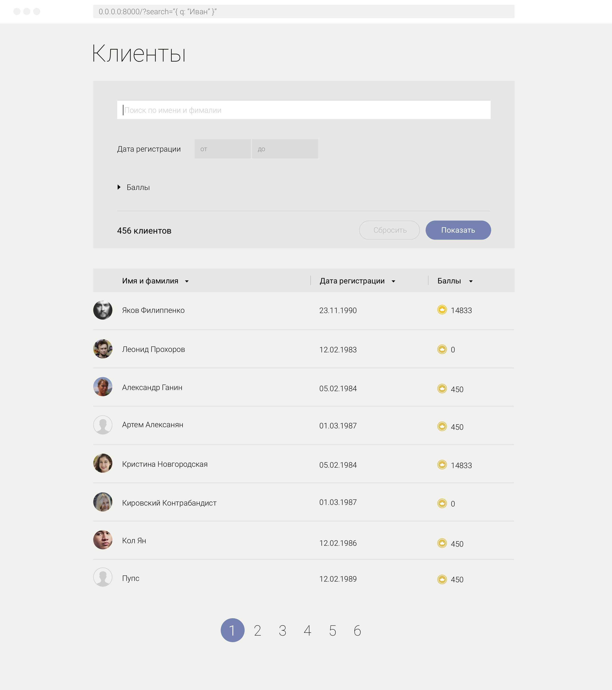
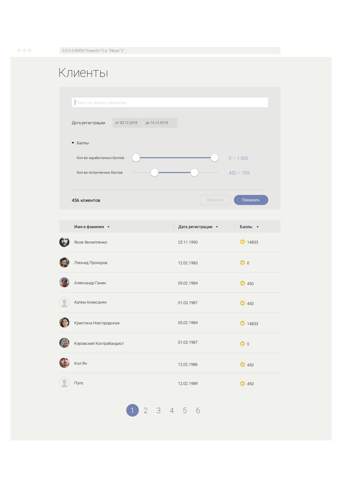

# Тестовое задание для кандидата на позицию фронт-енд разработчика

## Вводные данные:

### Дизайн: 

Свернутый

Развернутый

### Задание:

Написать одностраничное приложение, с одним роутом.

Базовая верстка находится в файле `./index.html`.

Страницу доверстать согласно дизайнам приложенным сверху:

#### 1. конструктор фильтров
На нем добавить конструктор фильтров для пользователей.

 Список пользователей получать из файла:
 `./data/users.json`
 
Часть фильтров сгруппирована по дерикториям (баллы).
 
Часть фильтров принимает значения   
из файла: `./data/search_limits.json` как максимальные и минимальные

Так же фильтры должны принимать 
установленные значения фильтров из адресной строки 
(формат не важен, в дизайне в качестве примера параметры указаны в виде JSON строки)

Фильтрация происходит по нажатию на кнопку "Поиск".

При нажатии на "Сбросить" значения фильтров сбрасываются до минимальных-максимальных 
или пустой строки для строки поиска.

Между фильтрами "И", то есть условия должны совпадать для всех фильтров сразу.

В поисковой строке поиск регистро-независимый.

#### 2. список пользователей

Необходимо добавить таблицу отфильтрованных пользователей
с кнопками сортинга и пагинацией по 20 на странице согласно дизайну.

В колонке "баллы" указывать значение `points_earned`.

Аватарки в дизайне лишние, в списке пользователей их нет.

### Комментарии:

1. Необходимые цвета и шрифты для верстки можно найти в файле `./src/theme/colors.less`
2. не обязательно делать задание полностью, Вы можете сделать из него столько, сколько сами
считаете достаточным для тестового задания.
3. Выполненное задание делать в отдельной ветке (назвать ее на Ваше усмотрение, например: `имя_фамилия` кандидата) и приложить пулл-реквест к основному репозитарию
с тестовым заданием.

### Тест-кейсы:

1. Верстка совпадает с макетами
2. По умолчанию отображаются сброшенные фильтры и первые 20 пользоватей
3. Настраиваю фильтры, нажимаю кнопку "Поиск", отображаются отфильтрованные пользователи
согласно указанным фильтрам.
4. Захожу на страницу, в адресной строке указываю значения фильтров. 
В фильтрах отображаются указанные значения, пользователи отфильтрованы согласно указанным значениям
5. По умолчанию, группа фильтров "Баллы" свернута, при нажатии на заголовок, она раскрывается.
6. Перемещаюсь по списку пользователей по страницам пагинации, сортирую список вверх\вниз, кликая на заголовки таблицы с пользователями.
7. Нажимаю кнопку "Сбросить" - значения в фильтрах сбрасываются. 
(для слайдеров, дат - на минимальные\максимальные. Для строки - пустая строка)
8. В левом нижнем углу компонента с фильтрами указывается количество отфильтрованных пользователей

